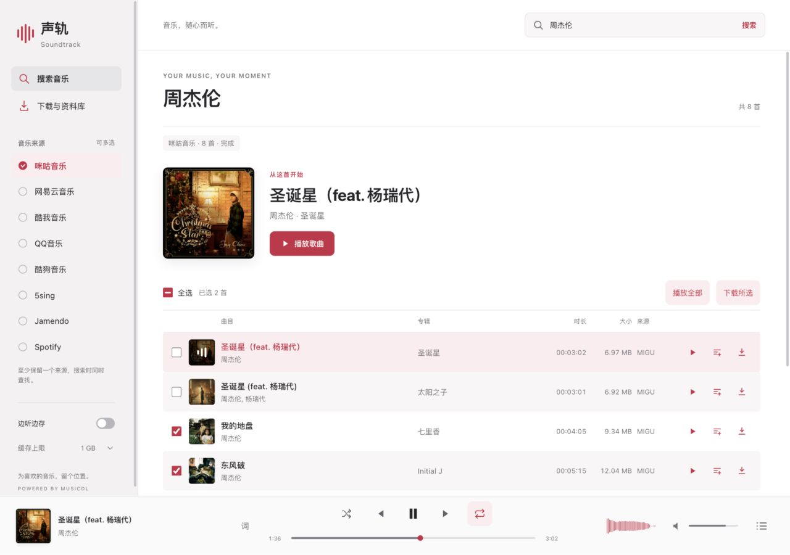
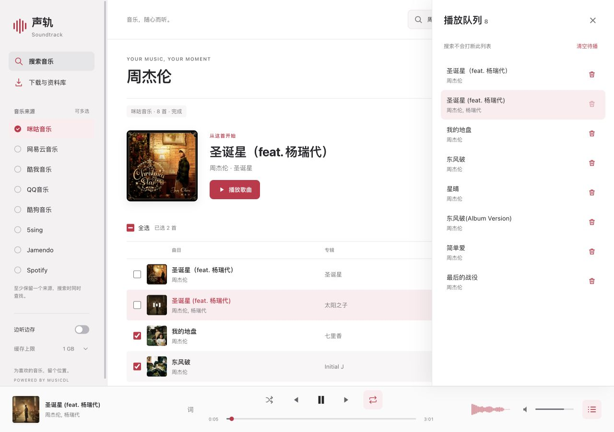

<div align="right">

**English** · [简体中文](README.md)

</div>

# Soundtrack · 声轨

Search for music, arrange a playback queue, and download selected tracks in one interface.

Soundtrack uses [musicdl](https://github.com/CharlesPikachu/musicdl) and runs in a local browser or as a packaged macOS / Windows desktop app. Its light interface includes an independent playback queue, shuffle and repeat modes, batch selection, and synced lyrics.

Eight sources are integrated: Migu, NetEase Cloud Music, Kuwo, QQ Music, Kugou, 5sing, Jamendo, and Spotify. Only Migu is enabled by default. Choose others in the sidebar, or the horizontal source list on phones. Availability depends on your network, provider APIs, and access permissions.



Screenshots show the current source version. Check each Release's notes for the features included in its package.

## How search results arrive

musicdl resolves an audio URL for each result, which can require several network requests. Soundtrack sends resolved tracks to the browser as they become available:

- **Per-result streaming.** The backend drives musicdl's `_search` directly, watches the result list it fills in as it resolves each track, and pushes every track to the browser the instant it's ready via Server-Sent Events (SSE). Results appear one by one instead of all at once after a long wait.
- **Concurrent sources.** Each source runs in a separate thread. Results from one source can appear while another is still searching.
- **Search timeout.** After `PER_SOURCE_TIMEOUT`, the app stops waiting for that source and reports its timeout without discarding other results.
- **Streaming playback.** The app streams the resolved URL through a backend proxy with HTTP Range support for seeking. You do not need to download the full track first.
- **Live download progress.** Chunked downloads report downloaded MB and speed in real time.

## Run

```bash
pip install -r requirements.txt
python app.py
# open http://127.0.0.1:5000 in your browser
```

Use `PORT=8080 python app.py` to pick a different port. Downloaded files are saved under `downloads/<source>/`.

## Build the macOS app

```bash
make app
open dist/Soundtrack.app
```

The build command installs the desktop-only packaging tools into `.venv`. The app saves music under `~/Downloads/Soundtrack/` by default, and the download drawer can select another folder; “Cache while playing” files are stored under `~/Library/Caches/Soundtrack/audio/`.

## Build the Windows app

Run in PowerShell on Windows:

```powershell
py -m venv .venv
.venv\Scripts\Activate.ps1
.\build-windows.ps1
```

The executable is created at `dist\Soundtrack\Soundtrack.exe`. You can also run the `Windows app` workflow from GitHub Actions and download its artifact.

> Your network must be able to reach the selected music platforms. For learning and research only. Please respect copyright and each platform's terms of service.

## Usage

- Type a keyword in the top bar to search; results stream in one by one.
- Toggle music sources in the sidebar (a horizontal list at the top on phones; only Migu is on by default). The light interface uses layered neutral surfaces, a berry-red accent, and system fonts with no online font dependency.
- The first returned track appears with artwork and, on desktop, a play button. Result order is not a popularity or recommendation ranking.
- Per-source status shows searching, result counts, timeouts, and request failures without hiding results from other sources.
- Select tracks or all current results, then use "下载所选" to add them to the existing concurrent download queue. Results arriving later are not automatically selected.
- "播放全部" creates an independent playback queue from the current results. New searches do not clear it; each row also offers a play-next action that inserts or moves the track.
- The player supports shuffle, sequential play, repeat-all, and repeat-one. Repeat-one applies at the natural end of a song; manual next/previous still changes tracks.
- The bottom-right queue button lets you inspect, play, remove, or clear queued tracks while retaining the current song. Playback queues and modes are session-only and reset on page reload.
- Each row offers play, play-next, and download buttons. Double-clicking a song row also plays it.
- Bottom player bar: previous / play-pause / next, seek, volume, live spectrum.
- “Cache while playing” keeps listened tracks locally and removes the oldest cache files when the selected 512 MB–5 GB limit is exceeded.
- The download drawer can run 1–5 downloads at once; additional tasks wait in click order.
- The "词" button opens synced lyrics. "下载与资料库" shows download tasks and lets you play or delete downloaded tracks. Desktop builds also support choosing the download folder and revealing songs in the file manager.
- New downloads create a matching `.lrc` and try to embed title, artist, album, lyrics, and artwork into MP3, FLAC, M4A, and OGG files; internal `.soundtrack.json` and `.soundtrack.cover.jpg/.png/...` files remain only as app index/fallback data.
- Shortcuts: `Space` to play/pause, `Alt+←/→` for previous/next track.
- `Esc` closes drawers. Focus the seek or volume slider and use arrow keys to adjust it, or `Home/End` to reach either end. Phones retain seeking and cache settings.



You can keep listening to the current queue while searching for other music. Favorites, cross-session queue restoration, and playlist-link import are not yet available.

## UI verification

```bash
node --test test_ui.cjs
python -m unittest -v test_app.py
```

Frontend regression tests need no extra Node.js packages and cover queue isolation, repeat/shuffle, batch selection, duplicate-download guards, stale responses, drawers, and keyboard controls. Live music providers still require manual online verification.

## Structure

```
app.py             Flask backend: streaming search (SSE) / audio proxy (Range) / cover proxy / download progress (SSE)
static/index.html  UI markup
static/style.css   Visual styling (Apple Music-inspired light workspace)
static/app.js      Frontend logic: streaming search / queue / Web Audio / lyrics / batch downloads
docs/             Pages showcase and screenshots; no hosted search or download service
```

## Configuration

Constants at the top of `app.py`:

- `SUPPORTED_SOURCES`: add or remove sources and change their defaults.
- `SEARCH_SIZE_PER_SOURCE`: how many tracks to resolve per source; larger values take longer.
- `PER_SOURCE_TIMEOUT`: how long to wait for each source, in seconds.

There is no login or Cookie settings interface. Developers can configure authorized source parameters in `ClientManager._build()` using the musicdl documentation. This does not guarantee access to a track, subscription quality, or protected format. Do not commit credentials.

Soundtrack plays and downloads direct audio URLs resolved by musicdl through its own HTTP flow, not the source-specific musicdl `_download` flow. It does not implement media decryption, HLS merging, transcoding, download-task recovery after a restart, or resumable downloads. Apple Music, Deezer, Joox, Qianqian, Qobuz, SoundCloud, StreetVoice, Soda Music, and TIDAL are not integrated. The Apple Music-inspired appearance does not imply access to the Apple Music service.

## Credits

Built on [CharlesPikachu/musicdl](https://github.com/CharlesPikachu/musicdl). All search and audio-resolution logic comes from musicdl; this project adds the streaming web UI, player, and download experience.
