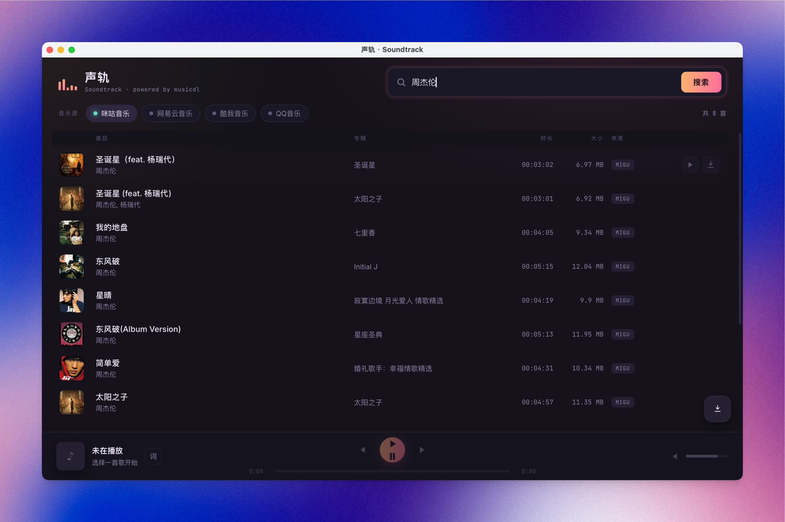

<div align="right">

[English](README.en.md) · **简体中文**

</div>

# 声轨 · Soundtrack

一个基于 [musicdl](https://github.com/CharlesPikachu/musicdl) 的现代化音乐 **搜索 / 下载 / 播放器**（Web 界面）。
支持咪咕、网易云、酷我、QQ、酷狗、5sing、Jamendo 和 Spotify 共八个音乐源。**咪咕是唯一默认开启的来源**，其余在界面顶部一键启用。



## 运行

```bash
pip install -r requirements.txt
python app.py
# 浏览器打开 http://127.0.0.1:5000
```

可用 `PORT=8080 python app.py` 指定端口。下载的文件保存在 `downloads/<源>/` 下。

## 构建 macOS 应用

```bash
make app
open dist/Soundtrack.app
```

构建命令会把仅桌面版需要的打包工具安装到 `.venv`。应用下载的音乐保存在 `~/Downloads/Soundtrack/`；“边听边存”缓存保存在 `~/Library/Caches/Soundtrack/audio/`。

## 构建 Windows 应用

在 Windows PowerShell 中运行：

```powershell
py -m venv .venv
.venv\Scripts\Activate.ps1
.\build-windows.ps1
```

程序生成在 `dist\Soundtrack\Soundtrack.exe`。也可以在 GitHub Actions 中运行 `Windows app` 工作流并下载构建产物。

> ⚠️ 需要能正常访问各音乐平台的网络环境。本工具仅供学习研究，请尊重版权与各平台条款。

## 使用

- 顶部输入关键词搜索，结果逐条流式出现。
- 顶部芯片切换音乐源（默认仅咪咕）。
- 每行：▷ 播放，⭳ 下载。双击行也可播放。
- 底部播放条：上一首 / 播放暂停 / 下一首、进度拖动、音量、实时频谱。
- “边听边存”可缓存播放过的歌曲，并按 512 MB–5 GB 的容量上限自动清理最旧缓存。
- 「词」按钮打开同步歌词面板；右下角按钮打开下载列表。
- 快捷键：空格播放/暂停，`Alt+←/→` 上一首/下一首。

## 结构

```
app.py             Flask 后端：流式搜索(SSE) / 音频代理(Range) / 封面代理 / 下载进度(SSE)
static/index.html  界面结构
static/style.css   视觉样式（深色"录音棚"主题）
static/app.js      前端逻辑：流式渲染 / Web Audio 频谱 / 同步歌词 / 下载
```

## 调整

`app.py` 顶部常量：

- `SUPPORTED_SOURCES` —— 增删音乐源、改默认开关。
- `SEARCH_SIZE_PER_SOURCE` —— 每个源尝试解析的歌曲数（越大越慢）。
- `PER_SOURCE_TIMEOUT` —— 单源超时秒数。

如需会员音质，可在 `ClientManager._build()` 里给对应源加 `default_search_cookies`，用法同 musicdl 官方文档。

Soundtrack 只使用 musicdl 在搜索阶段解析出的直接音频 URL。本阶段不实现专用媒体解密、HLS 分片合并或媒体转码，也不调用来源专用的 musicdl `_download` 流程；需要登录 cookies、付费账户或上述专用处理的内容不受支持。Apple Music、Deezer、Joox、千千音乐、Qobuz、SoundCloud、StreetVoice、汽水音乐和 TIDAL 本阶段未加入，其中 TIDAL 的专用下载处理不受支持。

## 致谢

基于 [CharlesPikachu/musicdl](https://github.com/CharlesPikachu/musicdl) 构建。所有搜索与音频解析逻辑均来自 musicdl；本项目在其之上提供了流式 Web 界面、播放器与下载体验。
