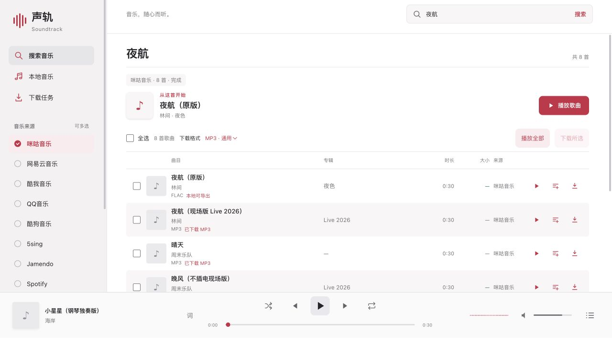
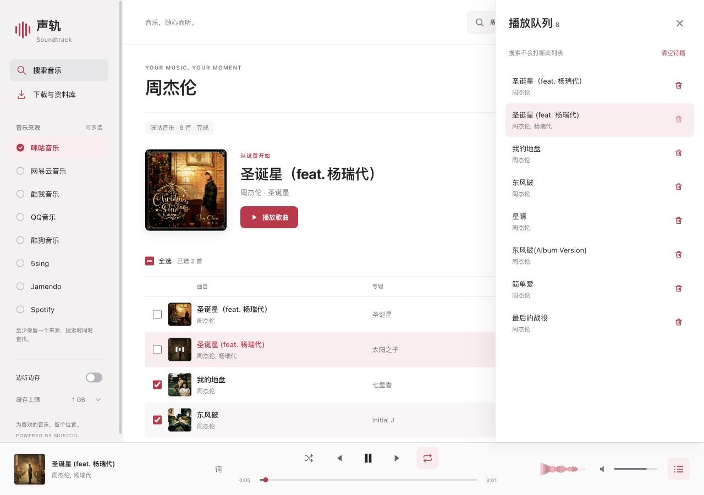
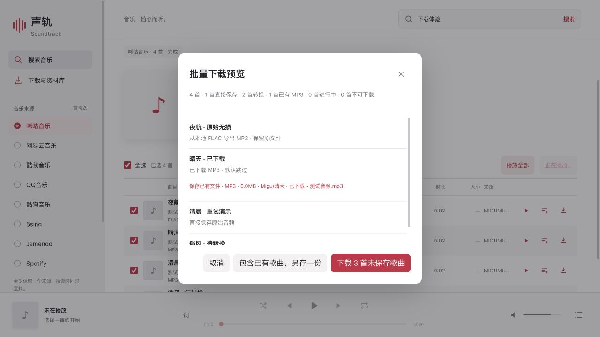
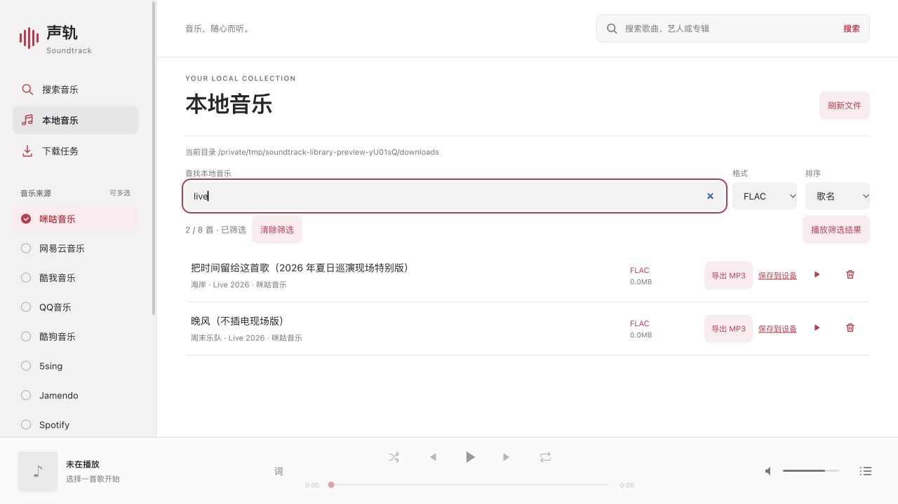

<div align="right">

[English](README.en.md) · **简体中文**

</div>

# 声轨 · Soundtrack

在一个界面里搜索音乐、安排播放顺序，再把选中的歌曲下载到本地。

声轨基于 [musicdl](https://github.com/CharlesPikachu/musicdl)，可在本机浏览器中运行，也可打包为 macOS / Windows 桌面应用。浅色界面提供独立播放队列、随机与循环播放、多选下载和同步歌词。

已接入咪咕、网易云、酷我、QQ、酷狗、5sing、Jamendo 和 Spotify。默认只开启咪咕，其余来源可在侧栏选择，手机端为顶部横向列表。不同来源的可用性取决于网络、接口和访问权限。



截图展示当前源码界面。发行包的功能请以对应 Release 说明为准。

## 运行

```bash
pip install -r requirements.txt
python app.py
# 浏览器打开 http://127.0.0.1:5000
```

可用 `PORT=8080 python app.py` 指定端口。下载的文件保存在 `downloads/<源>/` 下。

## 构建 macOS 应用

```bash
make app
open dist/Soundtrack.app
```

需要 Apple 命令行开发工具。构建命令会校验固定版本源码并编译精简音频转换工具，再把桌面打包工具安装到 `.venv`；首次构建需要联网并耗时数分钟。应用默认把音乐保存在 `~/Downloads/Soundtrack/`，也可在下载面板中选择其他目录；“缓存已播放歌曲”的临时文件保存在 `~/Library/Caches/Soundtrack/audio/`。

## 构建 Windows 应用

先安装 MSYS2 UCRT64 构建环境，所需软件包见[音频工具构建说明](docs/audio-tools.md)，然后在 Windows PowerShell 中运行：

```powershell
py -m venv .venv
.venv\Scripts\Activate.ps1
.\build-windows.ps1
```

程序生成在 `dist\Soundtrack\Soundtrack.exe`，旁边的支持文件必须保留。发布时 `Windows release` 工作流会构建应用，并将 ZIP 和音频工具对应源码包上传到同一 GitHub Release。

> 需要能正常访问所选音乐平台的网络环境。本工具仅供学习研究，请尊重版权与各平台条款。

## 使用

- 顶部输入关键词搜索，结果逐条流式出现；最近 10 条搜索保存在本机，可点击复用、单项移除或清空。音乐来源选择也会保留。
- 左侧切换音乐源（默认仅咪咕；手机端为顶部横向列表）。浅色界面采用灰白分层、莓红强调色和系统字体，不依赖在线字体。
- 桌面搜索结果顶部保留紧凑的首曲摘要和播放入口；手机端直接展示列表。曲名允许换行以保留现场版、伴奏等原有信息，来源使用易读名称，NULL 等无意义占位值不再直接显示；排列顺序不代表热度或推荐排名。
- 来源状态区分别显示搜索中、结果数、超时或请求失败；其他来源的结果不受影响。
- 勾选歌曲或全选当前结果，点击「下载所选」批量加入现有并发队列；搜索过程中后来出现的结果不会被自动选中。
- 「播放全部」用当前搜索结果建立独立播放队列。搜索其他歌曲不会清空正在使用的队列；行内「下一首播放」可插入或移动曲目。
- 播放条支持随机、顺序、列表循环和单曲循环；单曲循环只影响自然播完，手动切歌仍切到相邻曲目。
- 右下角队列按钮可查看、播放、移除待播曲目，或清空待播并保留当前歌曲；「清空全部并停止」同时停止播放。自动保存队列前 200 首、当前选择、随机顺序与循环模式，重新打开后保持暂停，不恢复播放进度。
- 下载面板显示未完成数量和退出影响。桌面版关闭窗口时，有提交中、排队、下载、转换或取消中的任务会弹出确认，选择「取消」可继续等待；全部完成或仅有失败记录时直接关闭。退出后未完成任务需要重新添加，已完成文件保留。
- 浏览器关闭/刷新时，仅在当前页面有已知未完成任务或正在提交时请求离开提示；提示内容和是否弹出由浏览器决定，部分移动浏览器可能不显示。关闭页面后，已提交任务在后台程序仍运行时继续；停止后台或强制结束进程会中断任务，不能拦截系统强制关闭，也不支持跨重启续传。桌面版使用原生确认，不重复弹浏览器提示。
- 恢复的远程歌曲在点击播放时重新获取链接，严格匹配来源与曲目/质量身份；无法确认同一版本时提示重试或重新查找，不自动替换同名歌曲。播放链接失效后最多自动重新连接一次。本地歌曲检查目录、相对路径、大小及修改时间；文件变化或移走后需要重新选择。
- 记录只存曲目信息和偏好，不存播放地址、临时凭据或歌词。浏览器记录按地址（含端口）分别保存；清除网站数据会移除记录，多标签页以最后操作保存的状态为准。桌面版使用独立持久浏览器目录和固定本机端口 `42001`，仅可运行一个实例；端口被占用时退出，不打开其他服务。旧版临时会话不能迁移。存储不可用时仍可使用当前会话。
- 每行提供播放、下一首播放和下载按钮，双击歌曲行也可播放。
- 结果上方可设置「下载格式」：默认 MP3，也可选择原始 FLAC 或「每次选择」，设置在本浏览器中保留。按次选择时，仅在全部所选歌曲原本就是 FLAC 时提供 FLAC；取消不会创建任务。
- 下载前检查本地文件与进行中的任务：同一来源、曲目和质量已有目标格式时，提供查看已有文件、另存一份和取消；同一任务不重复排队。批量下载只确认一次，默认跳过已有歌曲，并列出需要转换或不可下载的项目。
- 新下载文件的身份信息随 `.soundtrack.json` 保留，重新搜索或重启后仍可识别。旧文件和缺少可靠曲目身份的结果只作同名提示，不因歌名相同自动跳过；移走文件后可重新下载。
- 原始 MP3/FLAC 按对应格式直接下载；其他音频下载后可转为 320 kbps MP3，不提供转 FLAC。转换不会提升原始音质，缓存命中也执行相同格式检查。任务显示检测、等待转换、转换和保存状态；同时最多转换一首，取消会清理临时文件。重复下载保留已有音频并使用不同文件名。
- 底部播放条：上一首 / 播放暂停 / 下一首、进度拖动、音量、实时频谱。
- “缓存已播放歌曲”开启后，在开始播放时后台尝试缓存整首歌曲；再次缓存播放或写入完成时，按 512 MB–5 GB 上限清理最久未使用的缓存。上限调整在下次缓存播放时生效，写入中可暂时超限；关闭开关不取消已开始的缓存。
- “管理播放缓存”显示占用、完成数量和写入状态，支持刷新及确认后清理。清理只处理应用生成的顶层缓存文件，保留活动写入、符号链接、音乐源工作目录及已下载音乐；无法删除的文件会提示重试。缓存与下载目录互相包含时禁用缓存管理和自动回收，请调整为独立目录。
- 缓存不会加入本地音乐，也不保证离线可用；长期保留歌曲请使用下载按钮。清理后再次播放可能需要重新加载。
- 下载面板可把同时下载数量设置为 1–5 首，超出的任务按点击顺序等待。
- 「词」按钮打开同步歌词面板。「下载任务」查看进度与最近完成；「本地音乐」在主内容区查找、播放和管理文件。桌面应用还支持在下载面板选择目录、在本地音乐中显示文件位置。
- 本地音乐支持按歌名、歌手、专辑输入关键词，组合格式筛选，并按最近保存、歌名或歌手排序；「清除筛选」恢复全部文件，「刷新文件」重新读取目录。计数显示筛选结果与总数，条件在当前页面会话保留。
- 调整本地筛选不影响正在播放的队列；点击歌曲或「播放筛选结果」才以当前可见列表建立新队列。切换搜索与本地音乐会保留各自内容。读取失败可重试；切换下载目录时先清空旧目录文件操作，防止同名文件被误操作。
- 资料库显示实际格式，非 MP3 文件可「导出 MP3」，保留原文件并支持取消。搜索结果命中已保存的同版本 FLAC 时，也会从本地导出 MP3，避免重新下载。
- 「最近完成」保留文件入口：桌面端显示文件，浏览器端保存到设备。移除完成记录不会删除音乐文件；失败任务展示完整原因，可单项重试或「重试失败项」。
- 刷新或重新打开下载面板会恢复当前后台进程中的任务，并同步其他页面的重试或移除操作；返回全部进行中任务及最近 100 条完成/失败记录。退出应用后任务记录不保留，音乐文件仍在资料库中。
- 新下载的歌曲会生成同名 `.lrc`，并为 MP3、FLAC、M4A、OGG 尽力嵌入歌名、歌手、专辑、歌词和封面；内部 `.soundtrack.json` 与 `.soundtrack.cover.jpg/.png/...` 仅供应用索引和兜底。
- 快捷键：空格播放/暂停，`Alt+←/→` 上一首/下一首。
- `Esc` 关闭面板；聚焦进度或音量条后，用方向键调节、`Home/End` 跳到两端。手机端保留播放进度条和缓存设置。





[手机端重复下载确认截图](docs/download-workflow-mobile.png) · [产品改进计划与完成状态](TODO.md)



[手机端本地音乐截图](docs/library-mobile.png)

队列与搜索结果分开管理，可以一边听当前列表，一边继续搜索。收藏和歌单链接导入尚未提供。

## 验证界面

```bash
node --test test_ui.cjs
python -m unittest -v test_app.py test_audio_formats.py test_download_workflow.py
```

前端回归测试不需要额外 Node.js 依赖，覆盖队列隔离、循环/随机、批量预检、重复确认、失败重试、任务恢复、资料库筛选排序及目录切换失败、异步响应竞争、面板和键盘操作。后端覆盖展示信息清理、跨搜索识别、并发判重、路径校验、文件保护与真实本地导出；测试使用隔离目录和生成的音频。真实音乐源仍需联网手动验证。

## 结构

```
app.py             Flask 后端：流式搜索(SSE) / 音频代理(Range) / 封面代理 / 下载进度(SSE)
static/index.html  界面结构
static/style.css   视觉样式（Apple Music 风格的浅色音乐工作台）
static/app.js      前端逻辑：流式搜索 / 独立队列 / Web Audio / 歌词 / 多选下载
static/session.js  历史与队列快照校验 / 持久存储 / 精确身份重解析
docs/             Pages 展示页与界面截图，不包含在线搜索或下载服务
```

## 调整

`app.py` 顶部常量：

- `SUPPORTED_SOURCES`：增删音乐源、修改默认开关。
- `SEARCH_SIZE_PER_SOURCE`：每个源尝试解析的歌曲数，增加数量会延长搜索时间。
- `PER_SOURCE_TIMEOUT`：单源搜索等待超时秒数。

目前没有账号登录或 Cookie 配置界面。开发者可参照 musicdl 文档，在 `ClientManager._build()` 中配置自己有权使用的来源参数；这不保证特定曲目、会员音质或受保护格式可用，也不要将凭据提交到仓库。

从 v0.7.0 起，macOS / Windows 桌面包内置精简 FFmpeg、FFprobe 和 LAME，可离线转换 MP3，无需额外安装；已有 v0.6.0 安装包不包含这些工具。仅启用音频处理和本地文件输入，不含视频编码器或网络协议。下载面板的「MP3 转换」显示就绪状态；异常时提供恢复说明和重新检测。

源码运行时，可安装带 `libmp3lame` 的 FFmpeg / FFprobe，或通过 `SOUNDTRACK_FFMPEG` / `SOUNDTRACK_FFPROBE` 指定可执行文件路径。查找顺序为显式配置、应用内置、系统 PATH / Homebrew；无效的显式配置不会被忽略。缺少或无法运行转换工具时，原始 MP3/FLAC 仍可直接保存，批量预检会标明需转换项目不可用。真实音频转换测试在工具不可用时跳过。

内置工具的完整许可证在应用的 `audio-tools/licenses` 中；对应源码与构建脚本随 Release 单独提供，不增加应用运行依赖。版本、校验值、重建步骤和发布要求见[音频工具说明](docs/audio-tools.md)。

开发验收可通过 `SOUNDTRACK_SETTINGS_DIR` 指定独立的桌面设置与网页存储目录，同时隔离下载和缓存目录；打包冒烟测试会自动使用临时目录。

维护者发布新版本可参照 [GitHub 网页发布指南](docs/releasing.md)，包含创建版本、检查自动打包和失败后重试的步骤。

Soundtrack 使用 musicdl 在搜索阶段解析出的直接音频 URL，通过自己的 HTTP 流程播放和下载，不调用来源专用的 musicdl `_download`。支持本地转 MP3，但不实现专用媒体解密、HLS 分片合并，也不提供下载任务的跨重启恢复和断点续传。Apple Music、Deezer、Joox、千千音乐、Qobuz、SoundCloud、StreetVoice、汽水音乐和 TIDAL 尚未接入；界面借鉴 Apple Music 的视觉风格，不代表接入了 Apple Music 服务。

## 致谢

基于 [CharlesPikachu/musicdl](https://github.com/CharlesPikachu/musicdl) 构建。所有搜索与音频解析逻辑均来自 musicdl；本项目在其之上提供了流式 Web 界面、播放器与下载体验。
